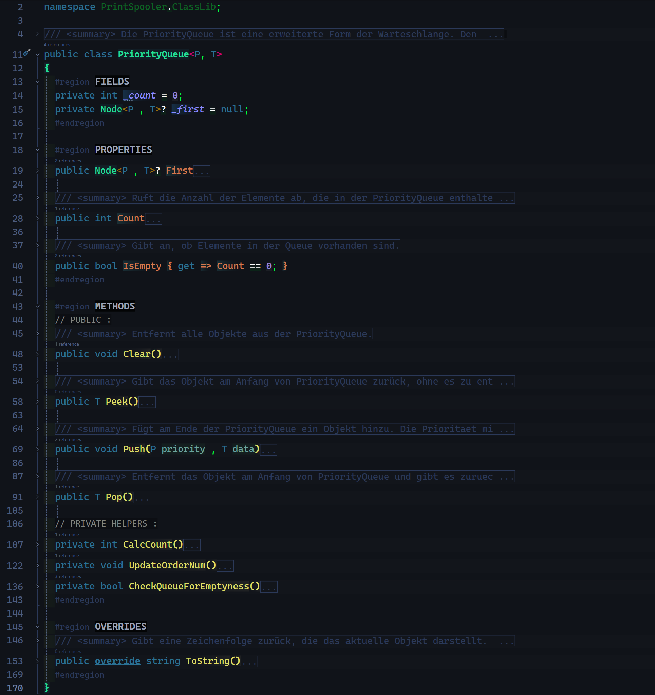
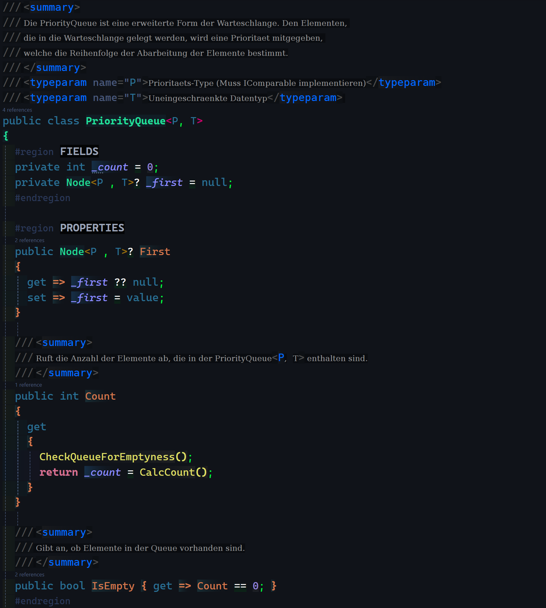
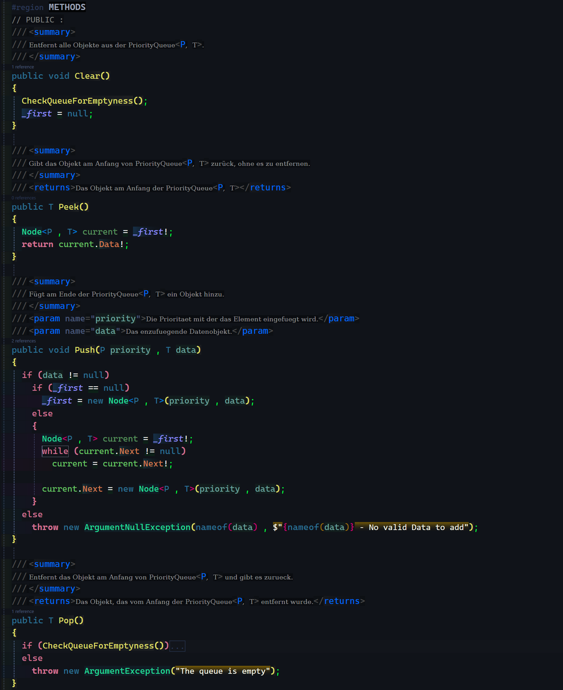
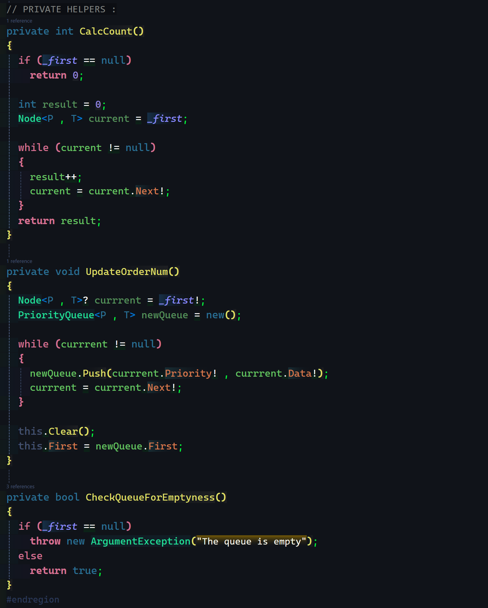
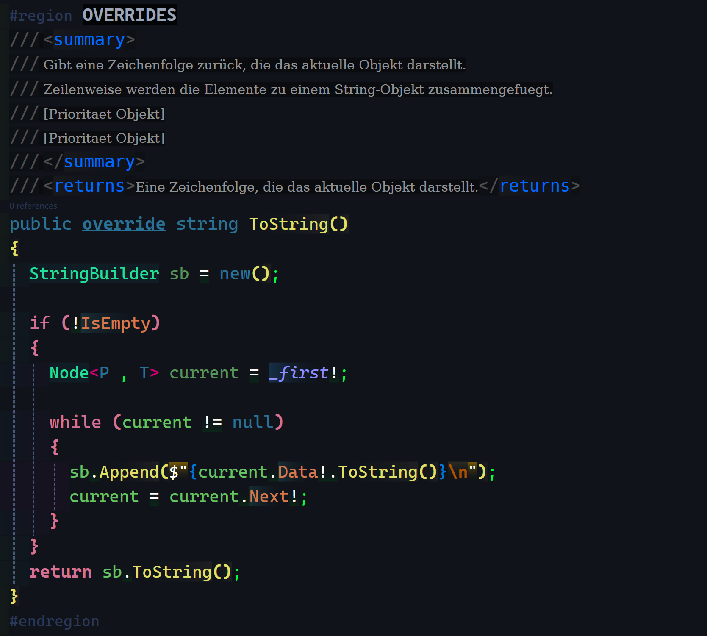
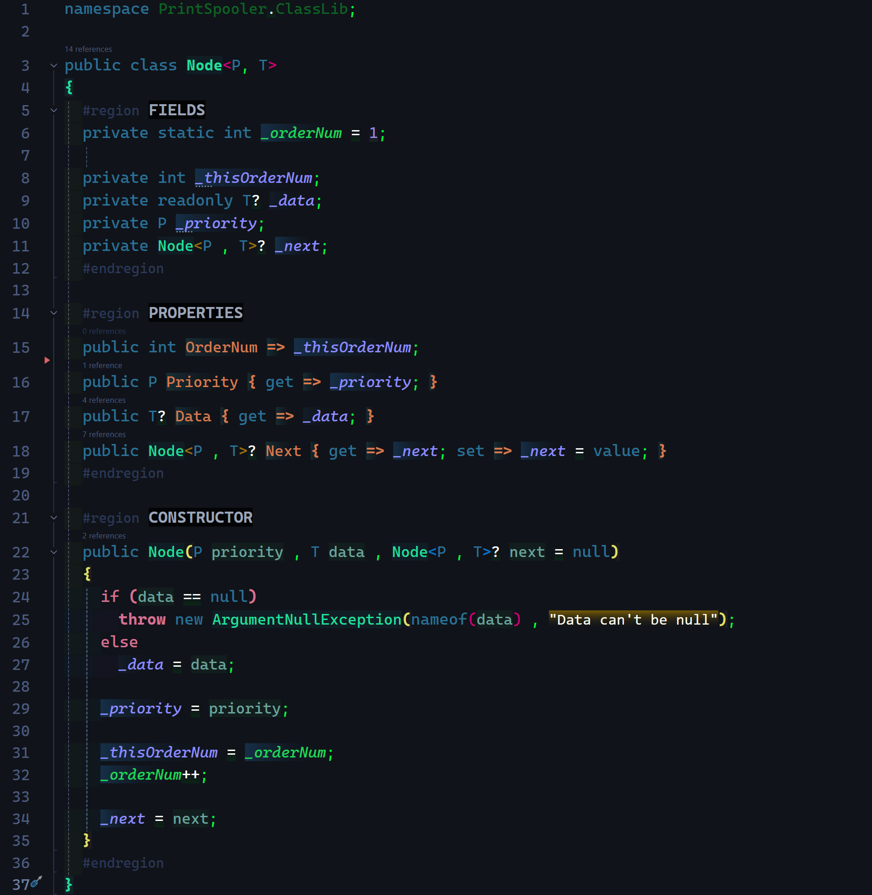

# PoseUebung-008 -- Print Spooler (Generic)

## Class PriorityQueue (overview):  
   

---  

- #### Fields & Properties:  

- #### Methods (public):  

- #### Methods (private helper):  

- #### Overrides:  

---  
## Class Node:  
 